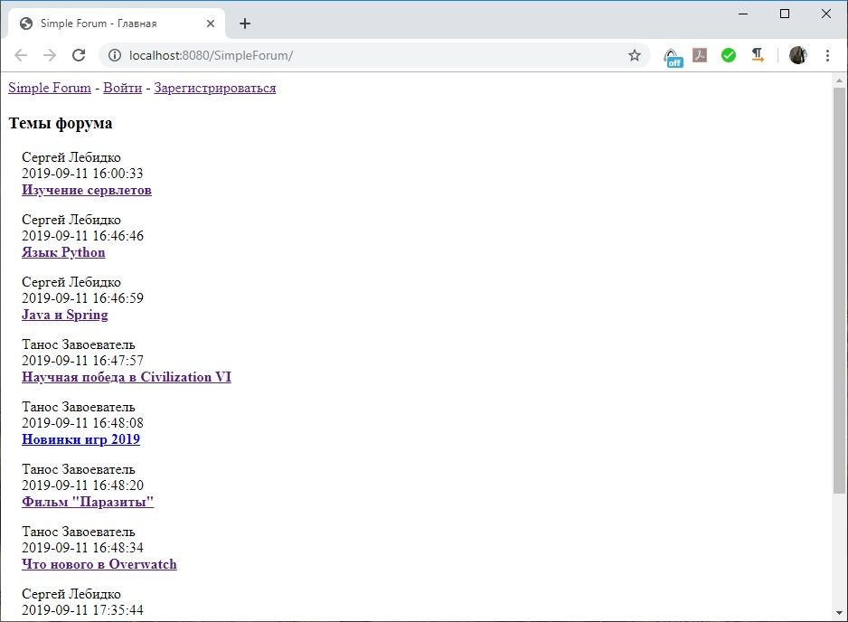
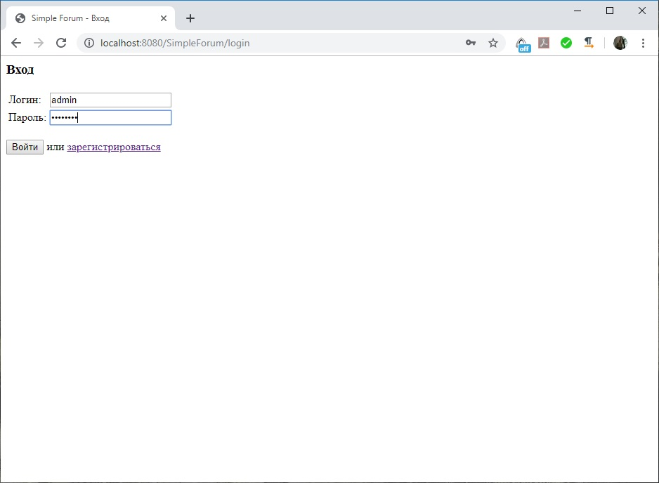
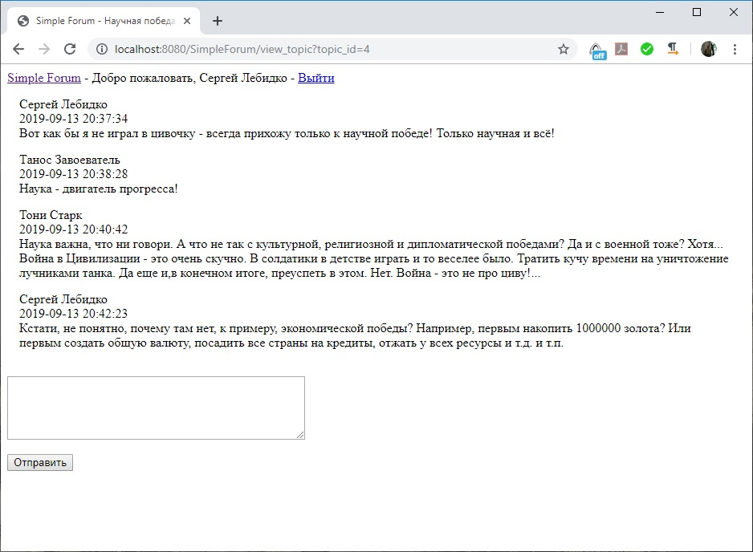
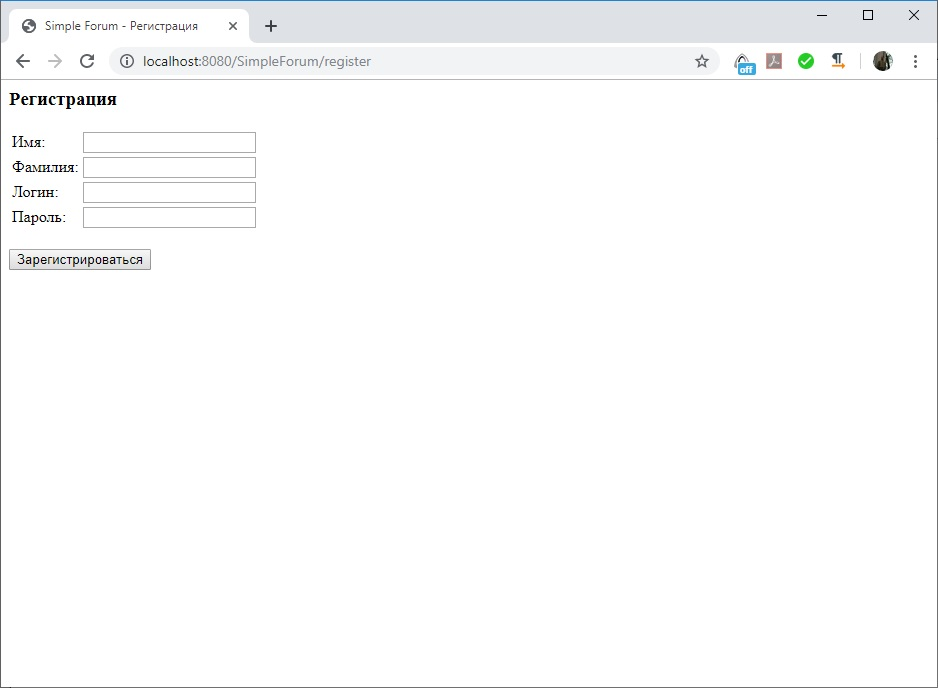

# SimpleForum

Данный проект - простой форум на Java.
Можно просматривать любые темы и сообщения по этим темам, но добавление новых тем и сообщений доступна только для зарегистрированных пользователей.
В качестве базы данных для проекта я использовал PostgreSQL. SQL-код для создания таблиц БД я привожу в файле SQL.txt. Также замечу, что код этот сформирован автоматически программой pgAdmin. Таблицы и связи между ними я создавал в ней.
Назначение сервлетов, думаю, понятно уже из их названий, поэтому приводить их описание здесь я не считаю нужным.
В пакете Utilities собраны вспомогательные функции, используемые всеми сервлетами: проверка текущей сессии, извлечение параметров даты и времени в из LocalDateTime и Map, создание заголовка, общего для всех страниц. Таким образом устраняется дублирование кода в сервлетах.
В пакете filters собраны фильтры для сервлетов. Они выполняют простейшие функции: устанавливают кодировку для получаемых и отправляемых данных и добавляют к отправляемому html-коду теги <html> и </body></html>, тем самым, также устраняя дублирование кода.
Пакет dao содержит все классы, используемые приложением для доступа к данным и представления сущностей (аккаунты, темы, посты к отдельным темам) в базе данных. Класс DAOContainer запускается первым при старте приложения и инициализирует подключение к БД (для работы с БД я использую Spring JDBC)

Скриншоты проекта:

